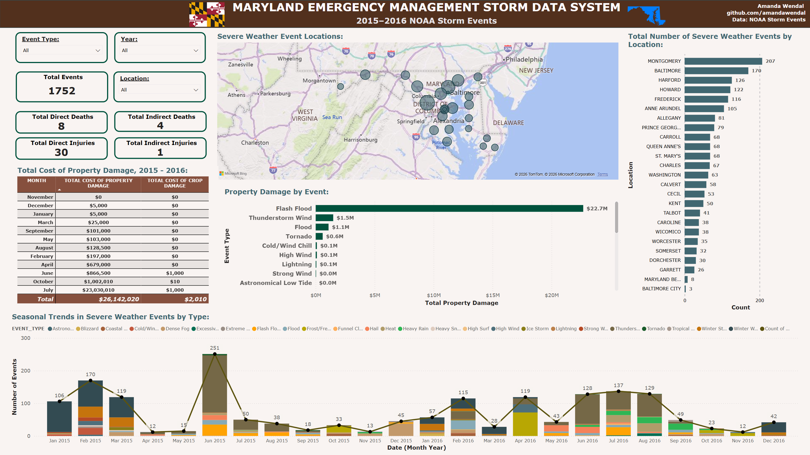

# Maryland Storm Events Dashboard

An interactive Power BI dashboard analyzing NOAA Storm Events data for Maryland from 2015 to 2016, with a focus on flash flood damage by county and over time.

## The question
Which severe weather events cause the most damage in Maryland, and where and when do they happen?

## Data
- **Source:** NOAA National Centers for Environmental Information, Storm Events Database
- **Scope:** 1,752 severe weather events in Maryland, January 2015 through December 2016

## What I did
- Filtered the national NOAA Storm Events file down to Maryland events in Power Query
- Removed unneeded columns, including long free-text narrative fields
- Standardized county names: fixed inconsistent capitalization and apostrophes, and merged National Weather Service forecast zones (e.g., "Northwest Howard") into their counties so county totals are accurate
- Built DAX measures and a Power BI report with slicers for event type, year, and county
- Designed visuals for event locations (map), events by county, property damage by event type, and seasonal trends by month

## Key findings
- **Flash floods caused about 87% of all property damage** ($22.7M of $26.1M).
- **One county, one month, one storm.** Howard County accounted for $22.4M in flash flood damage, all in July, with 2 direct deaths. That is about 99% of all flash flood damage and 86% of all property damage in the dataset, consistent with the July 30, 2016 Ellicott City flash flood.
- **More events did not mean more damage.** 2015 had more flash floods than 2016 (64 vs. 40) but only about $107K in flash flood damage, compared with about $22.6M in 2016.
- **The most active counties were not the most damaged.** Montgomery (207) and Baltimore (170) counties recorded the most severe weather events overall, and Baltimore (25) and Montgomery (24) had the most flash floods. Howard had only 10.
- **June 2015 was the busiest month,** with 251 events, driven mostly by thunderstorm wind.

## Takeaway
Event counts alone can point planners in the wrong direction. In this data, where storms happen most often is not where the biggest losses happen, so resource planning should weigh severity and impact, not just frequency.

## Tools
Power BI · Power Query · DAX · Excel

## About
Built as part of my MS in Data Analytics at Southern New Hampshire University. This is a personal portfolio project and is not affiliated with any government agency.

**Amanda Wendal** · [LinkedIn](https://www.linkedin.com/in/amandawendal/)